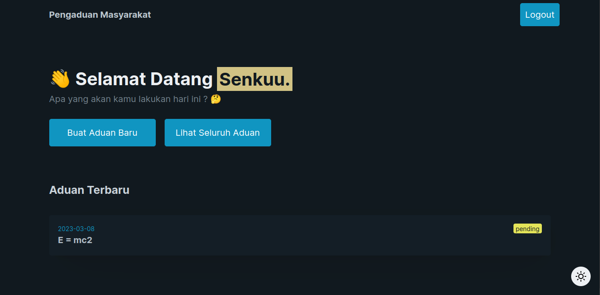

# Pengaduan Masyarakat v2 📍



Pengaduan masyarakat app sebagai latihan untuk menghadapi UKK 2023.

> Practice Makes Perfect

---

## Instalasi

Pastikan anda sudah menginstall [composer](https://getcomposer.org/doc/00-intro.md).  
Memenuhi requirements laravel [berikut](https://laravel.com/docs/10.x/deployment#server-requirements).  
Versi PHP >= 8.1  
Kemudain jalankan perintah berikut di terminal.

```bash
composer update
php artisan migrate
php artisan serve
```

## Login

Login sebagai Petugas:

```bash
localhost:8000/login-petugas
```

| username | password | level   |
| -------- | -------- | ------- |
| admin    | admin    | admin   |
| petugas  | petugas  | petugas |

Login sebagai Masyarakat:

```bash
localhost:8000/login
```

| username | password |
| -------- | -------- |
| admin    | admin    |
| petugas  | petugas  |
